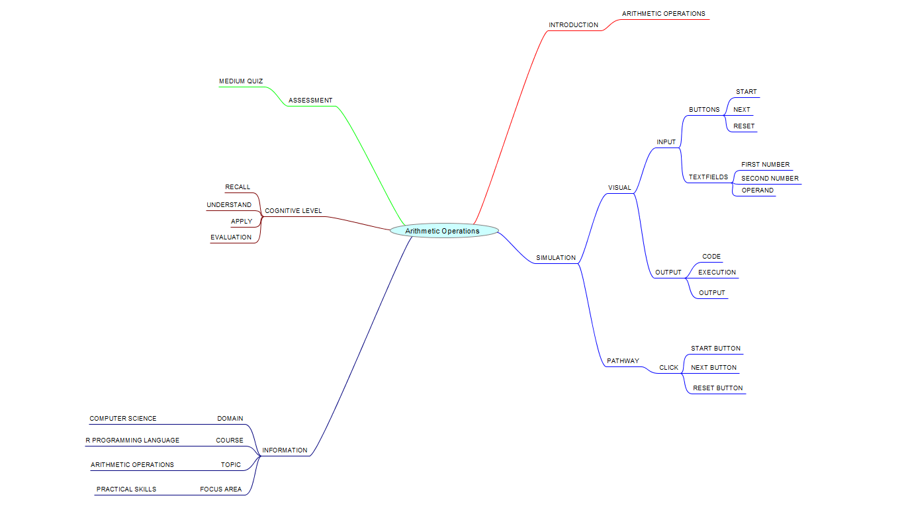
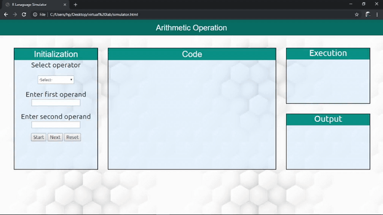

## Round 2

Experiment 1: Arithmetic operations

### 1. Story Outline:

 The experiment involves the use of R simulator implementing various arithmetic operations. Performing arithmetic operations on large numbers can be a difficult job to accomplish. This difficulty can be countered with the help of R simulator that provides a friendly programming environment to the beginners, so that every new user can easily perform arithmetic operations and can implement in various R programs.

### 2. Story:

#### 2.1 Set the Visual Stage Description:
<h2>Construction of the set-up</h2>

For better visualization, the simulator is divided into three sections:  
➢	Input Section (Initialization): Helps in interacting with the user (accepting numbers as inputs). 
➢	Code Section(Execution): Displays the subsequent code for each type of choice the user takes to perform any operation. 
➢	Output Section: Displays the output that will be generated after the code runs successfully.

#### 2.2 Set User Objectives & Goals:
Sr. No |	Learning Objective	| Cognitive Level | Action Verb
:--|:--|:--|:-:
1.| User will be able to:  Recall the various arithmetic operations .     | Recall | Identify
2.| User will be able to:   Understand the types of arithmetic operators in R programming language and how to perform various arithmetic operations     | Understand| Describe
3.| User will be able to:  Implement/use arithmetic operators on input values in R programs. | Apply | Implement
4.| User will be able to:  Take the quiz to evaluate what they learnt and enhance his capabilities.   | Evaluation| Judge

</b>

#### 2.3 Set the Pathway Activities:

The simulator tab would allow:  
➢	The setup consists of a simulator that helps in performing arithmetic operations with the use of R interpreter. 
➢	Additionally, there will be three sections to work upon: Input Section, Code Section and Output Section. 
➢	The code section will display the R code for the type of operation you want to perform. 
➢	Once the experiment has been performed, you can take the quiz. 
 

##### 2.4 Set Challenges and Questions/Complexity/Variations in Questions:

Assessment Questions: 

1. Arithmetic operators are usually: 
a)	Unary 
b)	Binary 
c)	Ternary 
d)	None Of these  
2. Which of the following can be operands of Arithmetic operators? 
a)	Numeric
 
b)	Boolean
 
c)	Characters
 
d)	Both a&c
  
3. What is the output of the following code?  a=5 b=10 c=20 d=2 print((a+b)*d-c)  
a)	10 
b)	-270 
c)	23 
d)	None of the above  

##### 2.6 Conclusion:
The R interpreter has a number of arithmetic operations. They are loaded automatically as the interpreter starts and are always available. Thus, it makes it easier for a programmer to perform small but complex operations with ease.

##### 2.7 Equations/formulas: NA

### 3. Flowchart

### 4. Mindmap

 
### 5. Storyboard 

